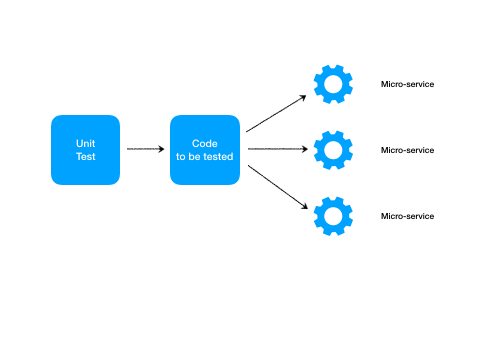

# httpunit
 

Programable HTTP server for micro-service unit testing

## Getting Started

httpunit can be used for mocking any micro-service by setting up your own server and route handler programmally.
With the ability of programming the server, unit test codes could expect any response from server as your wish.

httpunit listens on a pre-configured admin port after launched, from which unit tests could calls to the admin API to create, delete servers and set expect response for specified routes.

After the server created and route handler successfully set by admin APIs, the code to be tested could then issue requests to httpunit. The expected responses will send back to code to be tested. 

httpunit works in two modes: mock mode or proxy mode.

### Mock mode
In mock mode, httpunit acts as the micro-service you are going to mock. The code to be tested connect to httpunit just like connect to the real micro-service.



### Proxy mode
httpunit could act as an HTTP/HTTPS proxy as well. httpunit could modify the response from target service for any need of unit test. For example, simulate HTTP 404 for a specific resource even it exists in the real world. 

The real micro-services work behind the proxy, and the unit test could mock only specific APIs.

As well, everything is programmable.

## Installing 

```
npm install -D httpunit
```

Launching server:
```
var hu = require('httpunit');
hu.serve({
    mockOptions: {
        port: 8000
    },
    proxyOptions: {
        port: 8001
    }
});
```

## Mock APIs

httpunit provides very simple APIs to create, delete mock servers and set handlers for testing routes.

### Create server

A mock server will be created on a specified port and bind to a specified IP. But there're no route handlers installed for this server yet. Any requests to this server will get HTTP 404 response.

Request:
| path    | method |
| ------- | ------ |
| /server | POST   |

Request body:
```
{
    port: 9000,
    host: '127.0.0.1'
}
```

| field | optional | comments                                     |
| ----- | -------- | -------------------------------------------- |
| port  | no       | where the mock-service will listen on        |
| host  | yes      | which ip to be bind, default bind to 0.0.0.0 |

Response:
```
{
    serverId: 12345678
}
```
| field    | comments                                            |
| -------- | --------------------------------------------------- |
| serverId | used for identifying the mock server in further API |

### Delete server

Mock server could be shut down. But it's not always necessary, especially while httpunit running in process of unit test.

Request:

| path              | method |
| ----------------- | ------ |
| /server/:serverId | DELETE |


Response:
none

### install route handler

Define the behavior of mock server for the specific route. 

Request:
| path               | method |
| ------------------ | ------ |
| /:serverId/handler | PUT    |

Request body:
```
{
    path: '/abc/:id',
    method: 'GET',
    response: {
        delay: 200,
        status: 200,
        headers: {
            'X-any-header': 'any header value'
        },
        body: 'any string or object',
        cookies: [
            {
                name: 'any-cookie-name',
                value: 'cookie-value',
                signed: false,
                domain: 'google.com',
                httpOnly: false,
                expires: '2019-05-11T15:25:37.000Z',
                maxAge: 2000,
                path: '/',
                secure: false,
                sameSite: 'strict'
            }
        ]
    }
}
```
| field    | optional | comments                                                                                                |
| -------- | -------- | ------------------------------------------------------------------------------------------------------- |
| path     | no       | route path to be installed, string starts with '/'                                                      |
| method   | no       | HTTP method                                                                                             |
| response | no       | response behavior                                                                                       |
| delay    | yes      | undefined: response immediately                                                                         |
|          |          | 0: never response, request will be rejected                                                             |
|          |          | others: number in milliseconds, response will be sent only after this delay                             |
| status   | no       | response status code                                                                                    |
| headers  | yes      | array of headers to be appended to response. header field will be converted into lower case in response |
| body     | yes      | response body, could be string or JSON object                                                           |
| cookies  | yes      | cookies to be appended to response                                                                      |
| name     | no       | cookie name                                                                                             |
| value    | no       | cookie value                                                                                            |
| signe    | yes      | true for signed cookie, sign secret used in httpunit is 'secret'                                        |
| domain   | yes      | it's optional, but in most case it should be there                                                      |
| httpOnly | yes      | true for httpOnly cookies                                                                               |
| expires  | yes      | GMT time, 0 for session cookie                                                                          |
| maxAge   | yes      | max-age in milliseconds                                                                                 |
| path     | yes      | default to '/'                                                                                          |
| secure   | yes      | true to be used with HTTPS only                                                                         |
| sameSite | yes      | 'strict' or 'lax'                                                                                       |
## Proxy APIs

TBD